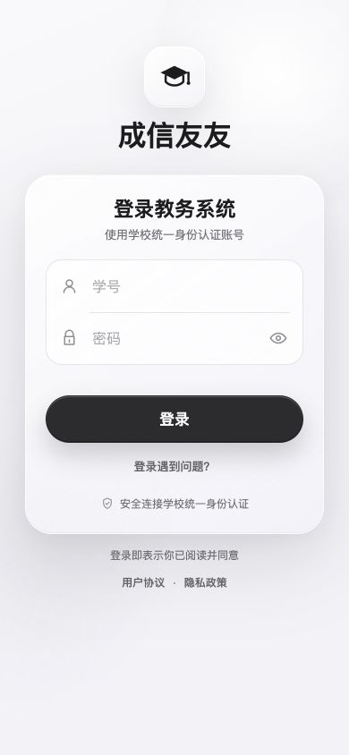
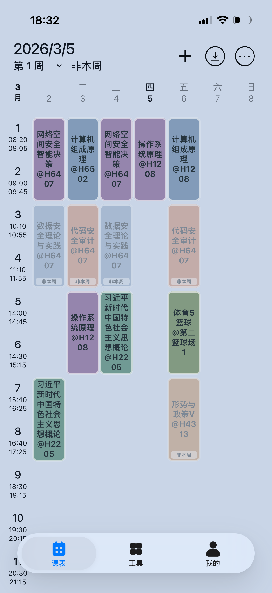
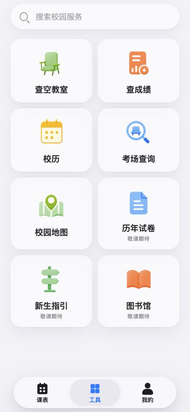
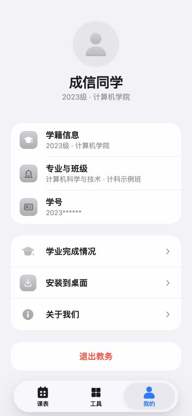
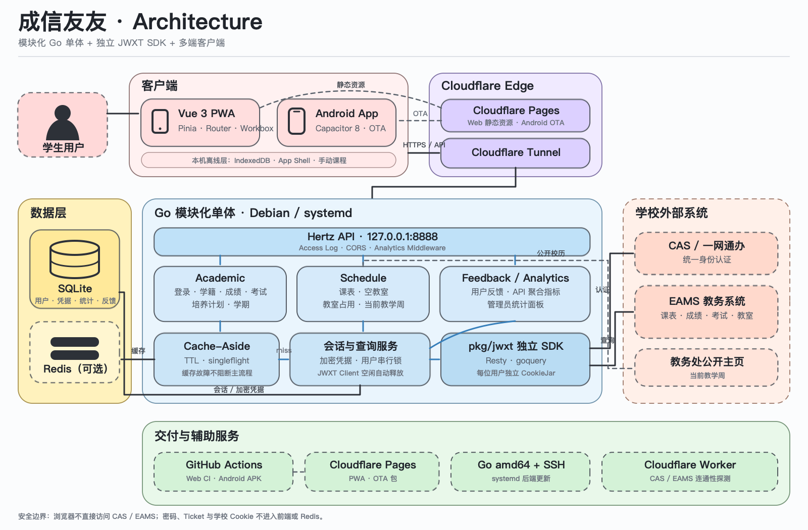

# 成信友友

[](https://github.com/shajinhui/cuit-server/actions/workflows/web.yml)
[](https://github.com/shajinhui/cuit-server/actions/workflows/android.yml)

面向成都信息工程大学学生的校园教务助手。项目将 CAS、EAMS 和一网通办登录流程封装在服务端，通过一个移动端优先的 PWA 提供课表、成绩、考试、空教室和学籍信息查询。

- 在线访问：<https://fanxiaogao05.dpdns.org>
- API 文档：[docs/API.md](docs/API.md)
- 部署说明：[deploy/README.md](deploy/README.md)
- SSH 后端更新：[deploy/SSH_BACKEND_UPDATE.md](deploy/SSH_BACKEND_UPDATE.md)
- Android 构建：[apps/web/ANDROID.md](apps/web/ANDROID.md)

> 本项目是非官方学生项目，与成都信息工程大学及学校教务系统运营方无隶属或授权关系。

<p align="center">
  
  
  
  
</p>

## 功能

- 统一身份认证登录及应用会话管理
- 学期列表、成绩和个人课表查询
- 期末考试、补考批次及考场安排查询
- 按学期、校区、教学周、星期和节次查询空教室
- 学籍信息与培养计划完成情况
- 教学周、公开校历和校园地图
- 最近课表、手动课程和教室占用数据的本机离线查看
- PWA 安装及 Capacitor Android APK

## 系统结构

<p align="center">
  
</p>

浏览器不直接访问学校认证系统。后端为每位用户创建独立的 `jwxt.Client` 和 `CookieJar`，避免不同学生的学校会话相互混用。

## 技术栈

| 部分 | 技术 |
|---|---|
| Web | Vue 3、TypeScript、Vite、Pinia、Vue Router、vite-plugin-pwa |
| Android | Capacitor 8、Gradle |
| API | Go、Hertz |
| JWXT SDK | Resty v2、goquery、`net/http/cookiejar` |
| 数据 | SQLite、Redis |
| 部署 | Cloudflare Pages、Cloudflare Tunnel、systemd |

## 目录

```text
.
├── apps/
│   ├── api/          # HTTP 服务入口
│   ├── web/          # Vue PWA 与 Android 工程
│   └── worker/       # EAMS/CAS 网络连通性探测
├── internal/         # 后端业务模块与基础能力
├── migrations/       # SQLite 迁移
├── pkg/jwxt/         # 独立的 CAS/EAMS/JWXT SDK
├── docs/             # HTTP API 文档
├── deploy/           # 正式环境部署说明与 systemd 配置
└── cmd/jwxt-demo/    # SDK 手动验证程序
```

各模块的实现约定见对应目录下的 README：

- [JWXT SDK](pkg/jwxt/README.md)
- [API 服务](apps/api/README.md)
- [Web 应用](apps/web/README.md)

## 本地开发

### 环境要求

- Go 1.25.12
- Redis
- Node.js 24
- pnpm 10.26.1

### 1. 配置并启动 API

```bash
git clone https://github.com/shajinhui/cuit-server.git
cd cuit-server

cp .env.example .env
openssl rand -base64 32
```

将生成的值写入 `.env` 的 `JWXT_CREDENTIAL_KEY`，然后启动：

```bash
go run ./apps/api
```

API 默认监听 `http://127.0.0.1:8888`。首次启动会自动创建 `data/cuit-server.db` 并执行数据库迁移。Redis 未启动时 API 仍可运行，但会跳过共享查询缓存。

### 2. 启动 Web

```bash
cd apps/web
pnpm install --frozen-lockfile
pnpm dev
```

Web 默认运行在 `http://127.0.0.1:5173`，开发服务器会将 `/api` 代理到本地 API。

## 验证

后端：

```bash
go test ./...
go vet ./...
```

前端：

```bash
cd apps/web
pnpm run check
```

`pnpm run check` 会依次执行 ESLint、Vitest、TypeScript 类型检查和生产构建。网络集成测试默认不访问学校系统，显式测试方式见 [JWXT SDK 文档](pkg/jwxt/README.md)。

## 压测

企业级 k6 压测套件位于 [loadtest/](loadtest/README.md)，支持冒烟、负载、压力、浸泡和登录专项场景，使用真实会话与 Redis 缓存命中路径。

## 安全与隐私

- 不在前端保存教务密码、CAS Ticket 或学校 Cookie。
- 教务密码在服务端加密后存入 SQLite，加密密钥仅由环境变量提供。
- 应用 Session 只在数据库中保存 Token 哈希；浏览器使用 `HttpOnly` Cookie。
- Redis 只缓存有有效期的查询结果，不保存密码、Cookie、Token、Ticket 或 JWXT Client。
- 每位用户使用独立的 JWXT Client 和 CookieJar，同一用户的教务请求串行执行。
- 日志不得记录密码、Cookie、Token、Ticket 或完整认证重定向地址。
- `.env`、SQLite 数据库、Android 签名文件和真实账号不得提交到仓库。

完整开发约束见 [Agent.md](Agent.md)。

## 使用边界

本项目仅用于学习、个人信息查询和校园服务体验改进，不提供抢课、批量抓取、凭据共享或绕过学校访问控制的能力。学校页面或登录流程发生变化时，相关功能可能暂时不可用。

## 授权

仓库目前尚未添加开源许可证。公开代码仅代表允许查看，不自动授予复制、修改或分发权利。
