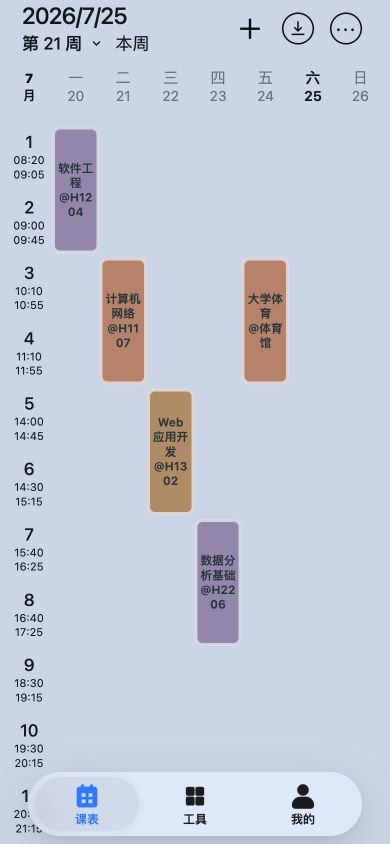
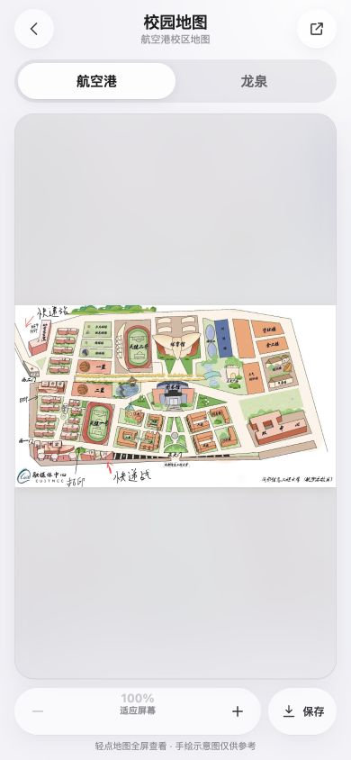

# 成信友友

## 一句话介绍

你的成信校园学习与生活助手。

## 简短介绍

面向成都信息工程大学学生的一站式校园助手，集中查看课表、空教室、考场安排、成绩、校历、学业进度与校园地图。

## 完整介绍

成信友友是一款面向成都信息工程大学学生的轻量校园 PWA。它把分散的教务信息和常用校园服务整理到一个清晰、易用的入口中，让课表、考试、成绩和校园信息随时可查。

打开应用即可查看当前教学周课表，并按学期、周次快速切换；空教室、考场安排、成绩、校历和双校区手绘地图集中收纳在工具页；“我的”页面则展示必要的学籍摘要与学业完成情况。

应用支持安装到手机桌面。成功同步的课表和必要的查询数据会保存在本机，网络暂时不可用时仍可查看最近一次数据。

## 功能亮点

- **一周课表**：按学期和教学周查看课程，支持手动添加本地课程。
- **离线查看**：成功同步后保存最近课表，弱网或断网时仍可访问。
- **空教室查询**：首次获取学期课表后在本地筛选，减少重复请求。
- **考场与成绩**：集中查看考试安排、今日考试与课程成绩。
- **校历与地图**：查看学校校历，以及航空港、龙泉校区手绘地图。
- **学业进度**：查看学籍摘要与学业完成情况。
- **桌面应用体验**：支持安装为 PWA，获得更接近原生应用的使用体验。

## 隐私与安全说明

- 学校统一身份认证凭据仅用于发起登录，前端不持久化保存密码、CAS Ticket 或学校 Cookie。
- 应用仅在本机保存实现离线访问所需的课表、手动课程和部分查询缓存。
- 退出教务或会话确认失效时，会清理与当前账号相关的本地业务数据。

> 成信友友是校园学习辅助工具，并非成都信息工程大学官方应用。课程、考试和学籍信息请以学校教务系统为准。

## 应用截图

截图尺寸均为 390 × 844。课表和个人信息使用与真实接口结构一致的本地示例数据渲染，不包含真实账号或学籍信息。

### 1. 安全登录

学校统一身份认证入口，页面保持简洁并明确安全边界。

### 2. 一周课表

在一屏内查看当前教学周、每日课程、节次与教室。

### 3. 校园工具

空教室、成绩、校历、考场与校园地图集中展示。

### 4. 我的

展示必要的学籍摘要，并提供学业完成情况和桌面安装入口。

### 5. 校园地图

支持航空港、龙泉校区切换，图片缩放、全屏查看与浏览器保存。

## 截图宣传语

1. 一周课程，一眼掌握
2. 常用校园服务，集中直达
3. 学籍与学业进度，清晰可见
4. 双校区手绘地图，随时查看
5. 安全连接学校统一身份认证
