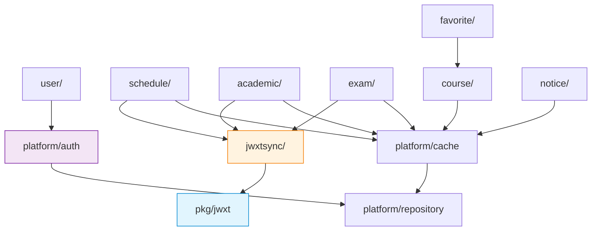

# Campus Assistant 架构设计文档

> 当前实现已经收敛为“单个 Hertz API + SQLite + 独立 JWXT SDK”，不使用 Redis 和 MySQL。本文后续涉及 Redis、MySQL 和后台 Worker 的内容仅保留为早期讨论，不代表当前实现要求；当前结构以 `README.md`、`Agent.md` 和代码为准。

第一版最适合做成 **模块化单体（Modular Monolith）**。

不要一开始拆微服务、上 Kafka、搞十几个仓库。你的核心复杂度不在服务间调用，而在：

- CAS / EAMS 登录流程
- 教务数据解析
- 缓存与限流
- 用户隐私与凭据安全
- 公共数据同步

先把这些边界划清，比拆服务重要得多。

---

## 一、整体架构

```
PWA 网页
        │
        │ HTTPS
        ▼
Cloudflare Tunnel
        │
        ▼
Nginx / Caddy（可后置）
        │
        ▼
Hertz API 服务
 ┌──────┼──────────────────────────────┐
 │      │                              │
 ▼      ▼                              ▼
鉴权    校园业务域                      后台 Worker
 │      │                              │
 │      ├── user/    用户域             ├── 同步课程目录
 │      ├── academic/ 成绩/GPA          ├── 同步通知
 │      ├── schedule/ 个人课表          ├── 更新课程容量
 │      ├── course/   公共课程          ├── 过期缓存清理
 │      ├── exam/     考试安排          └── 发送提醒
 │      ├── notice/   教务通知
 │      ├── favorite/ 收藏/选课方案
 │      └── jwxtsync/ 刷新编排
 │      │
 │      ▼
 │   pkg/jwxt（JWXT SDK）
 │      │
 │      ├── CAS 登录
 │      ├── EAMS 请求
 │      ├── Cookie 会话
 │      └── HTML / JSON 解析
 │
 ├───────────────┐
 ▼               ▼
Redis           MySQL
缓存/限流/锁      用户、课程、快照、收藏、通知
        │
        ▼
CAS / EAMS / 学校通知网站
```

其中最重要的是这条原则：

> [!IMPORTANT]
> **API 请求优先读 Redis / MySQL**
> 只有缓存未命中、用户主动刷新时，才调用 JWXT SDK 去访问学校系统。
> 不要让每个用户请求都实时打 EAMS。

---

## 二、项目结构

第一版建议一个仓库，**按业务域分包**：

```
campus-assistant/
├── apps/
│   ├── api/
│   │   └── main.go                 # Hertz API 启动入口
│   ├── worker/
│   │   └── main.go                 # 定时任务、同步、通知
│   └── web/                        # Vue 3 / TypeScript / Vite PWA
│
├── internal/
│   ├── bootstrap/                  # 初始化 DB、Redis、配置、依赖注入
│   │   ├── api.go                  # API 进程的初始化与依赖组装
│   │   └── worker.go               # Worker 进程的初始化与依赖组装
│   │
│   ├── platform/                   # 跨业务基础能力（不含业务逻辑）
│   │   ├── auth/                   # JWT 签发/验证、用户身份解析、权限
│   │   ├── cache/                  # Redis Key 管理、缓存封装、分布式锁
│   │   ├── config/                 # 配置加载（Viper / env）
│   │   ├── middleware/             # 日志、CORS、Recover、限流
│   │   ├── repository/             # 公共 DB/Redis 基础封装（BaseRepo）
│   │   ├── scheduler/              # cron / 定时任务注册框架
│   │   ├── notify/                 # 站内通知、推送接口
│   │   └── response/               # 统一错误码、统一 API 响应格式
│   │
│   ├── user/                       # 用户域
│   │   ├── handler.go
│   │   ├── service.go
│   │   ├── repository.go
│   │   ├── model.go
│   │   └── dto.go
│   │
│   ├── academic/                   # 成绩、GPA、学分
│   │   ├── handler.go
│   │   ├── service.go
│   │   ├── repository.go
│   │   ├── model.go
│   │   └── dto.go
│   │
│   ├── schedule/                   # 个人课表
│   │   ├── handler.go
│   │   ├── service.go
│   │   ├── repository.go
│   │   ├── model.go
│   │   └── dto.go
│   │
│   ├── course/                     # 公共课程目录、容量、选课计划
│   │   ├── handler.go
│   │   ├── service.go
│   │   ├── repository.go
│   │   ├── model.go
│   │   └── dto.go
│   │
│   ├── exam/                       # 考试安排
│   │   ├── handler.go
│   │   ├── service.go
│   │   ├── repository.go
│   │   ├── model.go
│   │   └── dto.go
│   │
│   ├── notice/                     # 教务通知、校园通知
│   │   ├── handler.go
│   │   ├── service.go
│   │   ├── repository.go
│   │   ├── model.go
│   │   └── dto.go
│   │
│   ├── favorite/                   # 收藏课程、备选课程、选课方案
│   │   ├── handler.go
│   │   ├── service.go
│   │   ├── repository.go
│   │   ├── model.go
│   │   └── dto.go
│   │
│   ├── jwxtsync/                   # 业务层的"教务刷新编排"
│   │   ├── service.go              # 编排 JWXT SDK 调用 + 缓存写入
│   │   ├── limiter.go              # 用户维度 + 全局维度限流
│   │   └── lock.go                 # 防止同一用户重复刷新的分布式锁
│   │
│   └── router/
│       └── router.go               # 汇总并注册所有 HTTP 路由
│
├── pkg/
│   └── jwxt/                       # 独立、可复用的教务 SDK
│       ├── client.go               # Client 接口与默认实现
│       ├── config.go               # SDK 配置（学校域名、超时等）
│       ├── cas_login.go            # CAS 登录完整流程
│       ├── eams_session.go         # EAMS 会话管理、Cookie 保持
│       ├── profile.go              # 学生信息查询
│       ├── course.go               # 课程查询
│       ├── grade.go                # 成绩查询
│       ├── exam.go                 # 考试查询
│       ├── parser/
│       │   ├── course_parser.go    # 课程 HTML 解析
│       │   ├── grade_parser.go     # 成绩 HTML 解析
│       │   └── exam_parser.go      # 考试 HTML 解析
│       ├── types.go                # SDK 公共数据类型
│       └── errors.go               # SDK 错误定义
│
├── migrations/
│   ├── 000001_init.up.sql
│   ├── 000001_init.down.sql
│   └── ...
│
├── deploy/
│   ├── docker-compose.yml
│   ├── nginx/
│   ├── cloudflared/
│   └── systemd/
│
├── configs/
│   ├── config.example.yaml
│   └── config.prod.yaml.example
│
├── scripts/
│   ├── build.sh
│   ├── migrate.sh
│   └── generate.sh
│
├── go.mod
├── Makefile
└── README.md
```

这套结构有三个关键设计决策：

### 1. 按业务域分包，而非按层分包

旧方式（按层）：`internal/handler/`、`internal/service/`、`internal/repository/` — 改一个功能要横跨多个目录。

新方式（按域）：`internal/schedule/` 下面自带 handler、service、repository、model、dto — **改课表只动 `schedule/` 目录**，边界清晰，未来拆微服务也天然是一个域拎出去。

### 2. `platform/` 放跨域基础能力

auth、cache、middleware、response 这些东西不属于任何一个业务域，放在 `platform/` 下统一管理，所有域都可以引用。

### 3. `bootstrap/` 做依赖组装

`api.go` 负责组装 API 进程需要的所有依赖（DB、Redis、各域 Service、路由），`worker.go` 组装 Worker 进程的依赖。**各域内部不负责初始化自己的基础设施。**

> [!TIP]
> 这里最关键的独立模块仍然是 **`pkg/jwxt`**。
> 它是整个项目最值得单独封装好的部分，不依赖任何 `internal/` 代码。

---

## 三、每层到底干什么

### 1. Handler：只处理 HTTP

每个域的 `handler.go` 只做四件事：

1. 接收参数
2. 校验参数
3. 调用本域 Service
4. 返回 JSON（通过 `platform/response` 统一格式）

**不要** 在 Handler 里直接写 `resty.New().R().Get(...)`，也 **不要** 直接写 SQL。

```go
// internal/schedule/handler.go

func (h *Handler) Refresh(ctx context.Context, c *app.RequestContext) {
    userID := auth.UserID(c)
    result, err := h.service.Refresh(ctx, userID)
    if err != nil {
        response.Error(c, err)
        return
    }
    response.OK(c, result)
}
```

示例路由注册（`internal/router/router.go`）：

```
POST /api/v1/auth/login          → user.Handler.Login
GET  /api/v1/me                  → user.Handler.GetProfile
GET  /api/v1/me/schedule         → schedule.Handler.Get
POST /api/v1/me/schedule/refresh → schedule.Handler.Refresh
GET  /api/v1/me/grades           → academic.Handler.GetGrades
POST /api/v1/me/grades/refresh   → academic.Handler.RefreshGrades
GET  /api/v1/courses             → course.Handler.List
GET  /api/v1/courses/:id         → course.Handler.Get
GET  /api/v1/courses/:id/capacity→ course.Handler.GetCapacity
POST /api/v1/favorites           → favorite.Handler.Add
DELETE /api/v1/favorites/:courseId→ favorite.Handler.Remove
GET  /api/v1/favorites           → favorite.Handler.List
POST /api/v1/course-plans        → favorite.Handler.CreatePlan
GET  /api/v1/course-plans        → favorite.Handler.ListPlans
GET  /api/v1/notices             → notice.Handler.List
GET  /api/v1/exams               → exam.Handler.List
GET  /api/v1/health              → platform/response.Health
```

---

### 2. Service：真正的业务规则

每个域的 `service.go` 封装该域的完整业务逻辑。

以 `schedule.Service` 为例：

```
ScheduleService.Refresh(userID)
├── 调 jwxtsync.Service 检查限流、获取锁
├── 调 JWXT SDK 获取原始课表
├── 调 repository.SaveSnapshot 写 MySQL 快照
├── 调 platform/cache 写 Redis 缓存
└── 返回统一数据结构（dto.ScheduleResponse）
```

实际刷新流程：

```
用户请求刷新课表
      ↓
jwxtsync.Limiter 检查距离上次刷新是否小于 30 秒
      ↓
jwxtsync.Lock 检查是否有正在进行的刷新
      ↓
platform/cache 检查 Redis 是否已有有效缓存
      ↓
没有缓存才进入 JWXT 请求队列
      ↓
jwxtsync.Limiter 全局信号量，最多允许 5 个并发打 EAMS
      ↓
pkg/jwxt 登录 CAS、获取课表、解析为 []Course
      ↓
schedule.Repository 保存快照
      ↓
platform/cache 写入缓存
      ↓
返回结果
```

> [!IMPORTANT]
> **`jwxtsync/` 是跨域的刷新编排层**。
> 它不属于 schedule 或 academic 任何一个域，而是统一管理所有 JWXT SDK 调用的限流、锁、并发控制。
> schedule.Service 和 academic.Service 都通过它来访问教务系统。

---

### 3. Repository：只负责存取数据

每个域的 `repository.go` 只做数据访问，不关心 CAS，不关心 HTTP。

```go
// internal/schedule/repository.go

type Repository interface {
    FindLatestSnapshot(ctx context.Context, userID int64, term string) (*model.ScheduleSnapshot, error)
    SaveSnapshot(ctx context.Context, snapshot *model.ScheduleSnapshot) error
}
```

```go
// internal/course/repository.go

type Repository interface {
    FindByTerm(ctx context.Context, term string) ([]model.Course, error)
    UpsertBatch(ctx context.Context, courses []model.Course) error
    FindByID(ctx context.Context, id int64) (*model.Course, error)
    Search(ctx context.Context, query string, term string) ([]model.Course, error)
}
```

公共的数据访问基础能力（事务管理、分页、通用 CRUD）放在 `platform/repository/` 中。

---

### 4. Model 与 DTO

每个域拥有自己的 `model.go`（数据库实体）和 `dto.go`（请求/响应结构）。

```go
// internal/schedule/model.go
type ScheduleSnapshot struct {
    ID        int64
    UserID    int64
    Term      string
    Data      string  // JSON 序列化的课表数据
    FetchedAt time.Time
    CreatedAt time.Time
}

// internal/schedule/dto.go
type RefreshRequest struct {
    Term string `json:"term" vd:"required"`
}

type ScheduleResponse struct {
    Term    string        `json:"term"`
    Courses []CourseItem  `json:"courses"`
    CachedAt string      `json:"cached_at"`
}
```

---

### 5. JWXT SDK：只负责学校系统

`pkg/jwxt` **不应该知道**：Hertz、Redis、MySQL、JWT、你的用户表、前端、Cloudflare。

它 **只知道**：

- 如何访问 EAMS
- 如何跳 CAS
- 如何保存 Cookie
- 如何登录
- 如何查课表 / 成绩 / 考试
- 如何解析 HTML
- 如何判断 Session 失效

对外暴露的接口要干净：

```go
// pkg/jwxt/client.go

type Client interface {
    Login(ctx context.Context, username, password string) error
    GetProfile(ctx context.Context) (*Profile, error)
    GetCourses(ctx context.Context, term string) ([]Course, error)
    GetGrades(ctx context.Context, term string) ([]Grade, error)
    GetExams(ctx context.Context, term string) ([]Exam, error)
    IsLoggedIn(ctx context.Context) (bool, error)
}
```

外层完全不用知道：JSESSIONID、CAS Ticket、302、loginType、redirectUrl、CookieJar — **这些全部封在 SDK 里**。

---

### 6. Platform：跨域基础能力

| 包                      | 职责                             |
| ---------------------- | ------------------------------ |
| `platform/auth/`       | JWT 签发与验证、从请求中提取 UserID、权限检查   |
| `platform/cache/`      | Redis Key 命名规范、缓存读写封装、分布式锁     |
| `platform/config/`     | 配置文件加载（Viper）、环境变量、配置结构体       |
| `platform/middleware/` | Hertz 中间件：日志、CORS、Recover、全局限流 |
| `platform/repository/` | BaseRepo、事务管理、分页查询封装           |
| `platform/scheduler/`  | cron 框架封装、任务注册接口               |
| `platform/notify/`     | 站内通知接口、推送抽象                    |
| `platform/response/`   | 统一 API 响应格式、统一错误码              |

---

### 7. Bootstrap：初始化与依赖组装

```go
// internal/bootstrap/api.go

func InitAPI(cfg *config.Config) (*server.Hertz, error) {
    db := initMySQL(cfg)
    rdb := initRedis(cfg)

    // 组装各域
    userRepo := user.NewRepository(db)
    userSvc  := user.NewService(userRepo)
    userHandler := user.NewHandler(userSvc)

    scheduleRepo := schedule.NewRepository(db)
    scheduleSvc  := schedule.NewService(scheduleRepo, jwxtsyncSvc, cacheSvc)
    scheduleHandler := schedule.NewHandler(scheduleSvc)

    // ... 其他域类似

    // 注册路由
    h := server.Default(...)
    router.Register(h, userHandler, scheduleHandler, ...)

    return h, nil
}
```

```go
// internal/bootstrap/worker.go

func InitWorker(cfg *config.Config) (*Worker, error) {
    db := initMySQL(cfg)
    rdb := initRedis(cfg)

    // 组装 Worker 需要的域 Service
    courseSvc := course.NewService(...)
    noticeSvc := notice.NewService(...)

    // 注册定时任务
    s := scheduler.New()
    s.Register("sync-courses", "0 3 * * *", courseSvc.SyncFromSchool)
    s.Register("sync-notices", "*/10 * * * *", noticeSvc.SyncFromSchool)

    return &Worker{scheduler: s}, nil
}
```

---

## 四、公共数据 vs 私人数据

这是项目后期能不能扛住的关键。

### 公共数据

所有人基本一样的数据：课程目录、课程时间、教师、课程容量、校历、考试通知、教务通知、空教室、活动信息。

```
学校系统
   ↓
Worker 定时同步
   ↓
MySQL（course/notice 域的表）
   ↓
Redis 缓存（platform/cache）
   ↓
用户查询直接返回
```

| 数据   | 同步频率     |
| ---- | -------- |
| 课程目录 | 每天同步     |
| 教务通知 | 10~30 分钟 |
| 课程容量 | 选课期短周期同步 |

> [!CAUTION]
> 普通用户查询课程时，**绝对不要每次请求学校**。

### 私人数据

不同学生不同：我的课表、成绩、考试、培养方案完成情况、已选课程。

```
用户主动刷新
   ↓
jwxtsync 检查限流 & 缓存
   ↓
缓存没有或过期
   ↓
pkg/jwxt 登录 CAS / EAMS
   ↓
获取个人数据
   ↓
对应域的 Repository 写入快照
   ↓
platform/cache 写入缓存
   ↓
返回
```

| 数据   | 缓存时长     |
| ---- | -------- |
| 课表   | 6~24 小时  |
| 成绩   | 10~30 分钟 |
| 考试   | 1~6 小时   |
| 选课状态 | 几十秒到几分钟  |

---

## 五、运行时拆成两个进程

虽然是一个仓库，但运行时建议两个进程。

### `apps/api`

- Hertz API 服务
- 登录、课表查询、课程搜索、收藏、选课方案、前端接口
- 依赖组装由 `bootstrap/api.go` 完成

### `apps/worker`

- 定时同步课程目录、同步通知、更新课程容量
- 过期缓存清理、发送提醒、异步写入任务
- 依赖组装由 `bootstrap/worker.go` 完成

```
Docker Compose
├── api          (apps/api/main.go)
├── worker       (apps/worker/main.go)
├── mysql
├── redis
├── cloudflared
└── nginx
```

> [!TIP]
> 这样某个同步任务卡住，不会拖垮用户 API。

---

## 六、核心业务域 — 开发优先级

按以下顺序推进：

| 优先级 | 域           | 说明             |
| --- | ----------- | -------------- |
| P0  | `user/`     | 注册、登录、JWT      |
| P0  | `schedule/` | 个人课表查询与刷新      |
| P0  | `jwxtsync/` | JWXT 调用编排、限流、锁 |
| P1  | `course/`   | 公共课程目录搜索       |
| P1  | `favorite/` | 收藏课程、选课方案      |
| P2  | `academic/` | 成绩、GPA         |
| P2  | `exam/`     | 考试安排           |
| P3  | `notice/`   | 教务通知           |

第一版真正需要的只有 P0 + P1。

> [!WARNING]
> 不要先做：AI 问答、RAG、选课推荐模型、复杂消息队列、微服务、多租户。
> 先把课表、课程搜索、收藏、冲突检测跑起来。

---

## 七、数据库表建议

第一期控制在以下这些表：

```
users
user_sessions
user_jwxt_credentials
courses
course_schedules
course_capacity_snapshots
user_schedule_snapshots
user_grade_snapshots
user_favorites
user_course_plans
notifications
sync_jobs
```

> [!WARNING]
> **`user_jwxt_credentials` 要非常谨慎。**
>
> 第一版甚至可以不建它，只做：
> 用户输入账号密码 → 临时查询 → 返回数据 → 不保存密码
>
> 等你真正跑稳定了，再做"记住教务登录"。

---

## 八、凭据与会话建议

你的系统至少有三种会话，**不要混**。

| 会话           | 用途       | 第一版方案           | 升级方案                |
| ------------ | -------- | --------------- | ------------------- |
| 校园助手登录态      | 你自己系统的身份 | JWT             | JWT + Refresh Token |
| CAS/EAMS 登录态 | 学校教务系统   | 请求内临时 CookieJar | Redis 短期加密缓存        |
| 用户长期凭据       | 记住教务密码   | 不保存             | 用户授权后加密保存           |

实现位置：

- JWT 签发/验证 → `platform/auth/`
- CookieJar 管理 → `pkg/jwxt/eams_session.go`
- 凭据存储（未来） → `user/repository.go` + 加密

> [!CAUTION]
> 绝对不要：
>
> - 前端 LocalStorage 存教务密码
> - MySQL 明文存密码
> - 日志输出 Cookie
> - 全局共享 CookieJar

---

## 九、教务请求限流结构

这个你一定要提前设计，由 `internal/jwxtsync/` 统一管理。

```
用户请求
   ↓
Hertz + platform/middleware 全局限流
   ↓
对应域的 Handler → Service
   ↓
jwxtsync.Limiter 用户维度限流
   ↓
platform/cache 缓存命中直接返回
   ↓
jwxtsync.Lock 防重复刷新
   ↓
jwxtsync.Limiter 全局 JWXT 信号量
   ↓
pkg/jwxt（Resty + CookieJar）
   ↓
CAS / EAMS
```

建议初始值：

| 维度          | 限制     |
| ----------- | ------ |
| 同一用户刷新课表    | 30 秒一次 |
| 同一用户刷新成绩    | 60 秒一次 |
| CAS 登录全局并发  | 3      |
| EAMS 查询全局并发 | 5~10   |

Go 里第一版不用 Redis 队列，`channel` 信号量就够：

```go
// internal/jwxtsync/limiter.go

var jwxtSem = make(chan struct{}, 5)

func withJWXTLimit[T any](fn func() (T, error)) (T, error) {
    jwxtSem <- struct{}{}
    defer func() { <-jwxtSem }()
    return fn()
}
```

以后多实例部署，再换 Redis 分布式限流或消息队列。

---

## 十、推荐的 API 设计

```
POST   /api/v1/auth/register           → user.Handler
POST   /api/v1/auth/login              → user.Handler
POST   /api/v1/auth/logout             → user.Handler

GET    /api/v1/me                      → user.Handler
GET    /api/v1/me/schedule             → schedule.Handler
POST   /api/v1/me/schedule/refresh     → schedule.Handler
GET    /api/v1/me/grades               → academic.Handler
POST   /api/v1/me/grades/refresh       → academic.Handler
GET    /api/v1/me/exams                → exam.Handler

GET    /api/v1/courses                 → course.Handler
GET    /api/v1/courses/:id             → course.Handler
GET    /api/v1/courses/:id/capacity    → course.Handler

POST   /api/v1/favorites              → favorite.Handler
DELETE /api/v1/favorites/:courseId     → favorite.Handler
GET    /api/v1/favorites              → favorite.Handler
POST   /api/v1/course-plans           → favorite.Handler
GET    /api/v1/course-plans           → favorite.Handler

GET    /api/v1/notices                → notice.Handler

GET    /api/v1/health                 → platform/response
```

注意：

- `GET /me/schedule` — 默认返回缓存
- `POST /me/schedule/refresh` — 才是真正可能打学校系统的操作

这样用户和前端都很容易理解，也方便你做限流。

---

## 十一、域间依赖关系



关键规则：

- **各业务域之间不直接互相调用 Service**（除非是明确的依赖，如 favorite 依赖 course 做课程校验）
- **所有域通过 `jwxtsync/` 访问教务系统**，不直接调 `pkg/jwxt`
- **`pkg/jwxt` 不依赖任何 `internal/` 代码**

---

## 十二、最适合你的开发顺序

| 步骤     | 内容                                                       | 涉及目录                                                      |
| ------ | -------------------------------------------------------- | --------------------------------------------------------- |
| 第 1 步  | JWXT SDK：跑通 CAS 登录                                       | `pkg/jwxt/`                                               |
| 第 2 步  | JWXT SDK：登录后拿一个简单页面                                      | `pkg/jwxt/`                                               |
| 第 3 步  | 解析个人课表，返回 `[]Course`                                     | `pkg/jwxt/parser/`                                        |
| 第 4 步  | Hertz 骨架 + `/health` + `bootstrap/api.go`                | `apps/api/`, `internal/bootstrap/`, `platform/`           |
| 第 5 步  | `schedule/` 域：Handler + Service + `/me/schedule/refresh` | `internal/schedule/`                                      |
| 第 6 步  | `jwxtsync/`：限流 + 锁                                       | `internal/jwxtsync/`                                      |
| 第 7 步  | Redis：缓存个人课表                                             | `platform/cache/`                                         |
| 第 8 步  | MySQL：保存用户、课表快照                                          | `internal/user/`, `internal/schedule/`, `migrations/`     |
| 第 9 步  | `course/` 域：公共课程目录 + Worker 同步                           | `internal/course/`, `apps/worker/`, `bootstrap/worker.go` |
| 第 10 步 | `favorite/` 域：收藏课程                                       | `internal/favorite/`                                      |
| 第 11 步 | 前端 PWA / Android 壳                                       | `apps/web/`                                               |
| 第 12 步 | Cloudflare Named Tunnel + 正式域名                           | `deploy/`                                                 |
| 第 13 步 | 通知、容量变化、选课计划                                             | `internal/notice/`, `internal/exam/`                      |

---

## 一句话总结

> 你这个项目最适合 **"一个 Go 单体项目 + API 进程 + Worker 进程 + Redis + MySQL + 独立 JWXT SDK"** 的架构。

真正的核心边界是：

| 层                 | 职责                                    |
| ----------------- | ------------------------------------- |
| **各域 Handler**    | 接收 HTTP 请求，调用本域 Service               |
| **各域 Service**    | 业务逻辑、缓存策略、数据编排                        |
| **各域 Repository** | MySQL / Redis 数据存取                    |
| **jwxtsync/**     | 统一编排 JWXT SDK 调用、限流、锁                 |
| **platform/**     | 跨域基础能力：auth、cache、middleware、response |
| **pkg/jwxt**      | CAS/EAMS 登录与数据抓取，完全独立                 |
| **bootstrap/**    | 初始化与依赖组装                              |
| **Worker**        | 定时同步公共数据                              |

这个结构以后就算用户从几十人涨到几千人，也不需要推倒重写。
